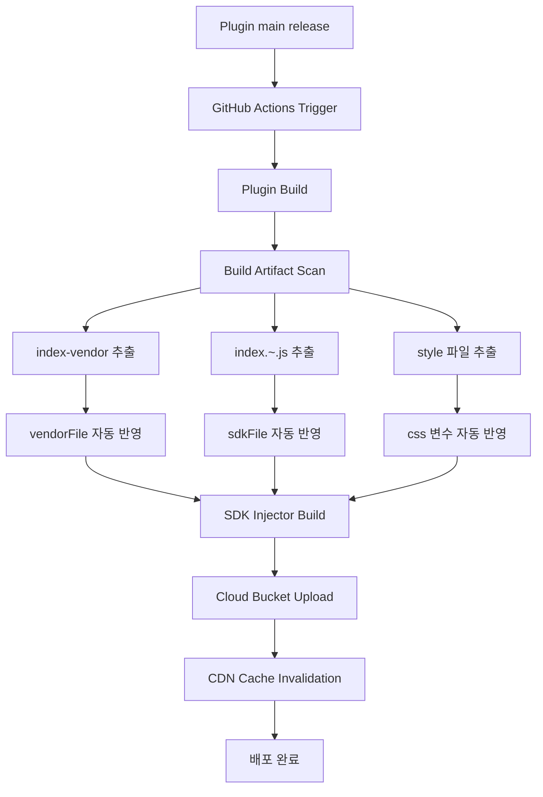

# Thatzfit SDK Injector

Thatzfit plugin을 SDK로 삽입하기 전에 필요한 초기 로딩 단계를 수행하는 loader 프로젝트입니다.

## 프로젝트 역할

- plugin이 렌더링될 `iframe`을 먼저 삽입합니다.
- 이후 plugin 코드를 로드해 SDK 삽입이 가능한 상태를 준비합니다.
- 즉, 최종 SDK 주입 전 단계에서 plugin 렌더링 환경과 코드 로딩을 연결하는 징검다리 역할을 담당합니다.

## 동작 개요

1. loader가 실행됩니다.
2. plugin 렌더링용 `iframe`이 생성/삽입됩니다.
3. plugin 소스가 로드됩니다.
4. SDK 삽입 프로세스가 이어집니다.

## 개선점

- 현재는 thatzfit plugin이 `main`에 release 되면 release된 프로젝트를 빌드한 뒤, 생성된 산출물 파일명을 수동으로 변경해야 합니다.
- 파일 매핑 규칙:
  - `index-vendor` 계열 파일은 `vendorFile` 변수에 수동 반영
  - `index.~.js` 파일은 `sdkFile` 변수에 수동 반영
  - `style` 계열 파일은 CSS 파일 변수에 수동 반영
- 프로젝트 release 시 빌드 결과물이 클라우드 버킷에 업로드되므로, 배포 직후 CDN 캐시 무효화(invalidation)도 함께 수행해야 합니다.
- 추후 이 수동 절차를 줄이기 위해 CI/CD 워크플로우를 GitHub Actions 기반으로 전환할 필요가 있습니다.

### CI/CD 개선방안 (Mermaid)

